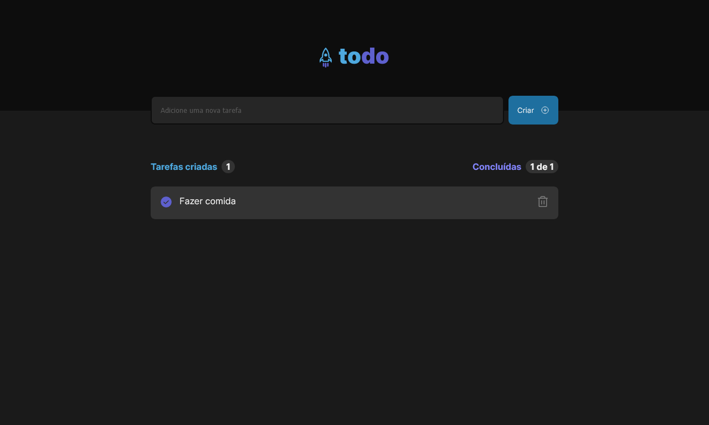

<h1 align="center">
  
</h1>

 

  

## 🚀 Tecnologias

Tecnologias utilizadas no projeto:

- ReactJS
- Vite
- Typescript
- Styled Components

 

## 💻 Projeto

O ToDo é uma aplicação para criar uma lista de tarefa, atualizar status para concluído e remover alguma tarefa.

 

## ⚒️ Features

- [x] Cadastro de tarefa
- [x] Checar a tarefa
- [x] Remover Tarefa
- [x] Contator de Tarefa

 

## 🔖 Layout

Layout da aplicação no [figma](https://www.figma.com/file/0n0zDN7zbzhRbaEO74Xesx/ToDo-List/duplicate?node-id=0-1).

 

## 🌐 Deploy

Você pode ver o site clicando [nesse link](https://todo-new-blue.vercel.app/).

 

## :memo: Licença

Esse projeto está sob a licença MIT. Veja o arquivo [LICENSE](.github/LICENSE.md) para mais detalhes.

---

Feito com ♥ por Gabriel Sousa
